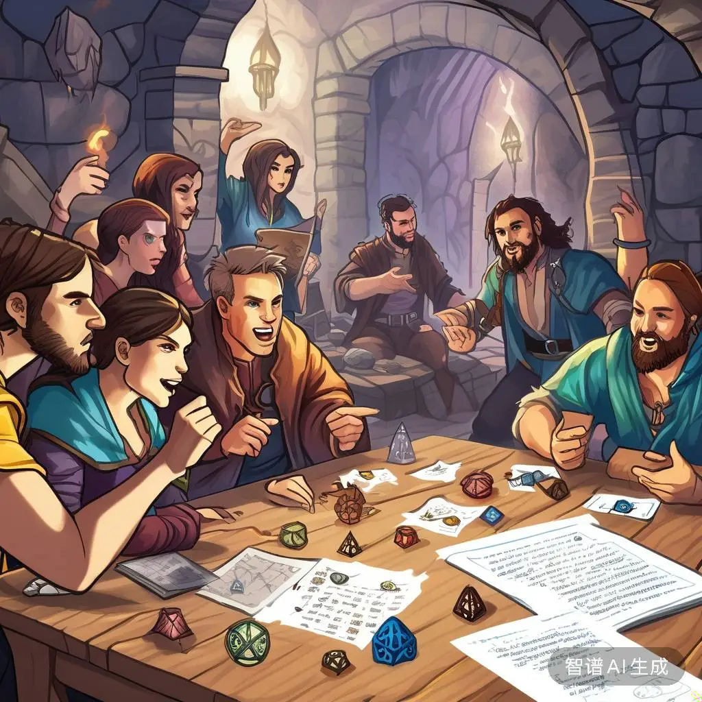

# My DnD Game

## To start

```bash
pip install zhipuai
python3 main.py
```

如果发现API连接失败，那应该是额度花完了，可以在llm.py中写入自己的APIKey。

## 演示demo

<details close>
    <summary style="cursor: pointer;">点击显示日志</summary>
    <pre>
result: 欢迎来到被遗忘的领域！请告诉我你的角色背景、偏好以及经验等级，我将为你定制一场刺激的冒险。
status: 初始化中，等待角色信息。
goal_percentage: 0.0
options:
        0: 创建新角色
        1: 选择预设角色
        2: 调整冒险设置
        3: 查看规则
        其它任意决策如：/status /quests /summary /commands

====================================================================================================
...***创建新角色***...
result: 好的，让我们开始创建你的角色。首先，选择一个种族、一个职业，并告诉我你的角色背景故事。
status: 角色创建中。
goal_percentage: 0.1
options:
        0: 选择精灵族
        1: 选择矮人族
        2: 选择人类
        3: 选择法师职业
        4: 选择战士职业
        5: 选择盗贼职业
        其它任意决策如：/status /quests /summary /commands

====================================================================================================
...***选择精灵族***...
result: 你选择了精灵族，你的角色获得了敏捷加成和夜视能力。现在，请选择一个职业，并描述你的角色背景。
status: 种族选择完成，等待职业选择和背景故事。
goal_percentage: 0.15
options:
        0: 选择法师职业
        1: 选择战士职业
        2: 选择盗贼职业
        3: 选择游侠职业
        4: 描述角色背景故事
        其它任意决策如：/status /quests /summary /commands

====================================================================================================
...***选择法师职业***...
result: 你选择成为一名法师，擅长使用奥术魔法。你的精灵法师拥有天然的魔法天赋。现在，请描述一下你的角色背景故事，这将有助于塑造你的角色形象。
status: 职业选择完成，等待角色背景故事。
goal_percentage: 0.2
options:
        0: 描述角色背景故事
        1: 选择法术
        2: 选择技能
        3: 查看法师职业特性
        其它任意决策如：/status /quests /summary /commands

====================================================================================================
...***描述角色背景故事***...
result: 你的角色背景故事是：作为一名在森林中长大的精灵，你对自然的奥秘有着深刻的理解。你的家族是守护一片神秘魔法遗迹的守护者，从小你就被教导如何使用魔法来保护这片土地。现在，你踏上了寻找知识和力量的旅程，希望有朝一日能够揭露盖侬的阴谋，拯救公主。
status: 角色背景故事描述完成，准备开始冒险。
goal_percentage: 0.25
options:
        0: 选择法术
        1: 选择技能
        2: 查看法师职业特性
        3: 开始冒险
        其它任意决策如：/status /quests /summary /commands

====================================================================================================
...***选择法术***...
result: 作为法师，你现在可以挑选一些基础法术。请选择以下法术中的几个：魔法飞弹、修复术、侦测魔法和睡眠术。
status: 法术选择中。
goal_percentage: 0.3
options:
        0: 选择魔法飞弹
        1: 选择修复术
        2: 选择侦测魔法
        3: 选择睡眠术
        4: 完成法术选择
        5: 寻求建议
        其它任意决策如：/status /quests /summary /commands

====================================================================================================
...***选择魔法飞弹***...
result: 你选择了魔法飞弹，这是一种远程攻击法术，可以对单一目标造成伤害。你的法术选择正在逐渐成形。
status: 法术选择中，已选择魔法飞弹。
goal_percentage: 0.35
options:
        0: 选择修复术
        1: 选择侦测魔法
        2: 选择睡眠术
        3: 完成法术选择
        4: 寻求建议
        其它任意决策如：/status /quests /summary /commands

====================================================================================================
...***选择修复术***...
result: 修复术是一个非常有用的辅助法术，可以治疗轻微的伤害。你的角色现在拥有了攻击和恢复的能力。
status: 法术选择中，已选择魔法飞弹和修复术。
goal_percentage: 0.4
options:
        0: 选择侦测魔法
        1: 选择睡眠术
        2: 完成法术选择
        3: 寻求建议
        其它任意决策如：/status /quests /summary /commands

====================================================================================================
...***选择侦测魔法***...
result: 侦测魔法将帮助你揭示附近的魔法效果和魔法物品。这个法术对于避免陷阱和识别有用的物品非常有用。
status: 法术选择中，已选择魔法飞弹、修复术和侦测魔法。
goal_percentage: 0.45
options:
        0: 选择睡眠术
        1: 完成法术选择
        2: 寻求建议
        其它任意决策如：/status /quests /summary /commands

====================================================================================================
...***选择睡眠术***...
result: 睡眠术可以让你使一个或多个生物陷入魔法睡眠。这是一个控制场面的强大法术，可以在战斗中创造优势。
status: 法术选择完成，已准备好开始冒险。
goal_percentage: 0.5
options:
        0: 完成法术选择
        1: 开始冒险
        2: 寻求建议
        其它任意决策如：/status /quests /summary /commands

====================================================================================================
...***完成法术选择***...
result: 你的法术选择已经完成，现在你已经准备好开始你的冒险了。你的角色拥有魔法飞弹、修复术、侦测魔法和睡眠术，这些法术将在你的旅途中发挥重要作用。
status: 法术选择完毕，准备开始冒险。
goal_percentage: 0.55
options:
        0: 开始冒险
        1: 调整装备
        2: 查看角色状态
        3: 寻求建议
        其它任意决策如：/status /quests /summary /commands

====================================================================================================
...***开始冒险***...
result: 你的冒险开始了！你来到了一个古老的森林，据说这里隐藏着通往盖侬要塞的秘密通道。你必须探索森林，寻找线索，并准备好面对可能出现的挑战。
status: 冒险进行中，正在探索古老森林。
goal_percentage: 0.6
options:
        0: 探索森林
        1: 寻找线索
        2: 与森林生物交流
        3: 检查装备
        4: 使用法术
        5: 寻求建议
        其它任意决策如：/status /quests /summary /commands

====================================================================================================
...***探索森林***...
result: 你深入森林，发现了一片神秘的遗迹。在这里，你发现了一条通往地下的暗道，似乎是一条前往盖侬要塞的秘密通道。
status: 在森林中发现了秘密通道。
goal_percentage: 0.65
options:
        0: 进入暗道
        1: 继续探索森林
        2: 标记通道位置
        3: 返回森林入口
        4: 使用法术侦测魔法
        5: 寻求建议
        其它任意决策如：/status /quests /summary /commands

====================================================================================================
...***进入暗道***...
result: 你勇敢地进入了暗道，发现了一连串的陷阱和谜题。通过智慧和法术，你成功绕过了这些障碍，深入了地下。
status: 正在通过暗道的陷阱和谜题。
goal_percentage: 0.7
options:
        0: 继续前进
        1: 检查陷阱
        2: 回顾谜题
        3: 使用法术侦测魔法
        4: 寻求建议
        5: 返回森林
        其它任意决策如：/status /quests /summary /commands

====================================================================================================
...***继续前进***...
result: 你决定不再耽搁，继续前进。你的决心让你在地下通道中快速前进，但同时也忽略了一些可能的危险征兆。
status: 在暗道中快速前进。
goal_percentage: 0.75
options:
        0: 遭遇意外
        1: 发现宝物
        2: 遇到盟友
        3: 使用法术侦测魔法
        4: 寻求建议
        5: 返回上一个检查点
        其它任意决策如：/status /quests /summary /commands

====================================================================================================
...***遭遇意外***...
result: 由于你的冒进，你不幸触发了一个陷阱，导致了一阵岩石崩塌。你设法逃脱，但这场意外让你的进度受到了影响。
status: 在陷阱中受伤，进度受阻。
goal_percentage: 0.65
options:
        0: 处理伤口
        1: 检查陷阱
        2: 继续前进
        3: 使用法术侦测魔法
        4: 寻求建议
        5: 返回上一个检查点
        其它任意决策如：/status /quests /summary /commands

====================================================================================================
...***处理伤口***...
result: 你使用修复术治疗了自己的伤口，感觉恢复了一些体力。虽然遭遇了挫折，但你依然坚定地继续你的冒险。
status: 伤口处理完毕，准备继续前进。
goal_percentage: 0.7
options:
        0: 继续前进
        1: 检查陷阱
        2: 回顾谜题
        3: 使用法术侦测魔法
        4: 寻求建议
        5: 返回森林
        其它任意决策如：/status /quests /summary /commands

====================================================================================================
...***继续前进***...
result: 你小心翼翼地继续前进，避免了之前的错误。你的谨慎让你发现了一处隐藏的房间，里面藏有宝贵的资源和一张地图，这可能有助于你找到通往盖侬要塞的道路。
status: 在暗道中发现隐藏房间和地图。
goal_percentage: 0.8
options:
        0: 研究地图
        1: 检查房间
        2: 搜索隐藏物品
        3: 使用法术侦测魔法
        4: 寻求建议
        5: 返回上一个检查点
        其它任意决策如：/status /quests /summary /commands

====================================================================================================
...***研究地图***...
result: 你仔细研究地图，发现了一条通往盖侬要塞的秘密路径。这张地图还标记了一些危险的区域和可能的捷径，对你的冒险非常有用。
status: 地图研究完成，获得了通往盖侬要塞的秘密路径。
goal_percentage: 0.85
options:
        0: 按照地图前进
        1: 检查房间
        2: 搜索隐藏物品
        3: 使用法术侦测魔法
        4: 寻求建议
        5: 返回上一个检查点
        其它任意决策如：/status /quests /summary /commands

====================================================================================================
...***按照地图前进***...
result: 你根据地图上的指示前进，避开了许多危险的陷阱和巡逻的生物。你的决策让你更接近了盖侬要塞，但同时也让你意识到这场冒险的艰难。
status: 沿着地图指示前进，接近盖侬要塞。
goal_percentage: 0.9
options:
        0: 准备进攻要塞
        1: 再次检查装备
        2: 寻找可能的盟友
        3: 使用法术侦测魔法
        4: 寻求建议
        5: 返回上一个检查点
        其它任意决策如：/status /quests /summary /commands

====================================================================================================
...***准备进攻要塞***...
result: 你检查了你的装备和法术，确保自己准备好了面对即将到来的挑战。你的准备让你信心满满，但你也知道，进攻盖侬要塞将是一场恶战。
status: 准备进攻盖侬要塞。
goal_percentage: 0.95
options:
        0: 发起攻击
        1: 侦察要塞
        2: 再次检查装备
        3: 使用法术侦测魔法
        4: 寻求建议
        5: 返回上一个检查点
        其它任意决策如：/status /quests /summary /commands

====================================================================================================
...***发起攻击***...
result: 你发起了对盖侬要塞的攻击，凭借你的智慧和力量，你成功击败了守卫，闯入了要塞的核心区域。在那里，你面对了盖侬本人，一场激烈的战斗即将展开。
status: 正在与盖侬进行最终对决。
goal_percentage: 1.0
options:
        0: 战斗
        1: 寻找逃脱路线
        2: 尝试和平解决
        3: 使用法术
        4: 寻求建议
        5: 撤退
        其它任意决策如：/status /quests /summary /commands

GG~
🎮🎉🎮 (＾▽＾) (＾▽＾) 🎉🎮🎉
To be continued~
====================================================================================================
...***游戏已经胜利，总结角色的经历和获得的成就，并依此给予玩家一个相应的评价。
***...
result: 恭喜你，勇敢的冒险者！你成功击败了盖侬，拯救了公主，成为了被遗忘领域的英雄。你的智慧和勇气在整个旅程中得到了证明，你不仅解开了古老的秘密，还展现了对自然的深刻理解和强大的魔法能力。你的成就将被世人传颂，你的名字将载入史册。干得好，真正的英雄！
status: 冒险成功，游戏结束。
goal_percentage: 1.0
options:
        0: 重新开始
        1: 查看成就
        2: 退出游戏
        其它任意决策如：/status /quests /summary /commands
    </pre>
</details>


## Documents
* [My LLM + D&D Game](https://zhuanlan.zhihu.com/p/692183088)


